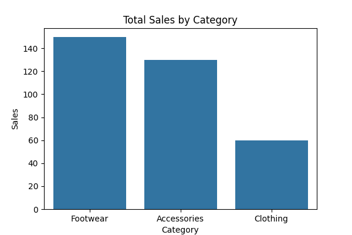
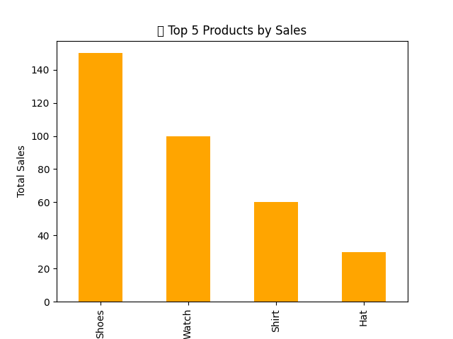

# 📊 Retail Sales Analytics (Python, 1M+ rows)

## 📌 Goal
Analyzed **1,067,371 e-commerce transactions** to generate actionable business insights.  
The project focuses on:
- Cleaning raw transactional data  
- Deriving key performance indicators (KPIs)  
- Building visualizations to support **data-driven decision-making**

### ✅ KPIs Delivered:
- 📈 Monthly revenue trends  
- 🛒 Top-selling products  
- 👥 High-value customers  
- 🌍 Regional sales distribution

## 🛠️ Tech Stack

- **Python** → Data analysis and scripting  
- **Pandas & NumPy** → Data manipulation & preprocessing  
- **Matplotlib & Seaborn** → Data visualization  
- **Jupyter Notebook** → Interactive analysis  
- **Git & GitHub** → Version control & collaboration  
 

---

## 📂 Project Structure
- **data/** → dataset (`retail_sales.csv`)  
- **src/** → main source code (`analysis.py`)  
- **reports/figures/** → generated charts & visualizations  
- **requirements.txt** → dependencies list  

---

## 📊 Example Visualization
Bar chart of sales by product category:  


- Monthly Sales Trend  
  

- Top 5 Products by Sales  
  

- Sales by Category  
  


  ## ✨ Highlights

- 📊 **Exploratory Data Analysis (EDA):** Clean and analyze retail dataset  
- 📈 **Sales Trend Analysis:** Identify revenue patterns over time  
- 🛒 **Top Products & Categories:** Find best/worst performers  
- 📉 **Profitability Insights:** Track margin and revenue distribution  
- 🔮 **F**


---

## 🚀 How to Run

1. Clone this repository:
   ```bash
   git clone https://github.com/saiseggoju/retail-sales-analytics.git
   cd retail-sales-analytics
